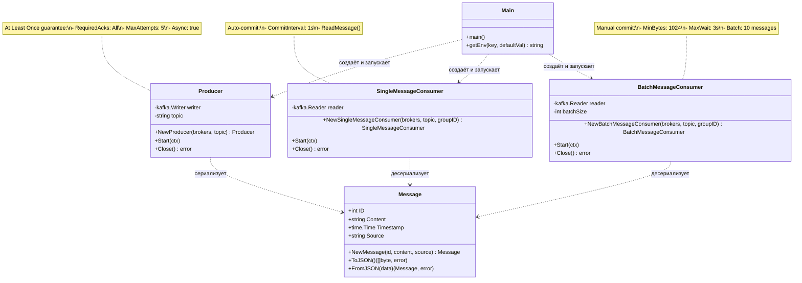

# Kafka Sprint 1 - JSON Serialization с гарантией At Least Once

## Описание проекта

Go-приложение для работы с Apache Kafka, реализующее:
- JSON сериализацию/десериализацию сообщений
- Гарантию доставки "At Least Once" на стороне продюсера
- Два типа консьюмеров: одиночный и пакетный
- Обработку ошибок сериализации/десериализации

## Архитектура приложения

### Схема классов



### Основные компоненты

#### 1. **Message Model** (`app/model/message.go`)

Структурированное сообщение для передачи через Kafka:

```go
type Message struct {
    ID        int       `json:"id"`        // Уникальный идентификатор сообщения
    Content   string    `json:"content"`   // Содержимое сообщения
    Timestamp time.Time `json:"timestamp"` // Время создания
    Source    string    `json:"source"`    // Источник сообщения
}
```

**Методы:**
- `NewMessage(id, content, source)` — создание нового сообщения
- `ToJSON()` — сериализация в JSON формат
- `FromJSON(data)` — десериализация из JSON

**Принцип работы:**
- При создании сообщения автоматически устанавливается текущее время
- Сериализация использует стандартный `encoding/json`
- При ошибках сериализации/десериализации возвращается `error`

#### 2. **Producer** (`app/producer/producer.go`)

Асинхронный продюсер с гарантией "At Least Once".

**Конфигурация:**
- `RequiredAcks: kafka.RequireAll` — все in-sync реплики должны подтвердить получение
- `MaxAttempts: 5` — до 5 попыток доставки при ошибках
- `WriteTimeout: 10s` — таймаут записи
- `ReadTimeout: 10s` — таймаут чтения подтверждений
- `Async: true` — асинхронная отправка с callback'ом подтверждения

**Принцип работы:**
1. Создаёт структурированное сообщение каждые 500 мс
2. Сериализует сообщение в JSON
3. Отправляет в Kafka с автоматическими повторами
4. Логирует успешные доставки и ошибки через Completion callback

**Гарантия At Least Once:**
- Сообщение считается доставленным только после подтверждения от всех in-sync реплик
- При временных сбоях автоматически повторяет отправку (до 5 раз)
- В случае успешной доставки при потере подтверждения возможна дублированная доставка

**Обработка ошибок:**
- Ошибки сериализации: логируются, сообщение пропускается
- Ошибки отправки: логируются, выполняются автоматические повторы
- Ошибки доставки: логируются через Completion callback

#### 3. **SingleMessageConsumer** (`app/consumer/single.go`)

Консьюмер с автоматическим коммитом оффсетов.

**Конфигурация:**
- `CommitInterval: 1s` — автоматический коммит каждую секунду
- `GroupID: single-message-consumer-group`
- Метод: `ReadMessage()` — блокирующее чтение с авто-коммитом

**Принцип работы:**
1. Считывает по одному сообщению
2. Логирует сырой JSON
3. Десериализует JSON в структуру Message
4. Логирует десериализованные данные
5. Автоматически коммитит оффсет

**Обработка ошибок:**
- Ошибки чтения: логируются, работа продолжается
- Ошибки десериализации: логируются с выводом сырых данных, сообщение пропускается

#### 4. **BatchMessageConsumer** (`app/consumer/batch.go`)

Консьюмер с пакетной обработкой и ручным коммитом.

**Конфигурация:**
- `MinBytes: 1024` — минимум 1KB данных за fetch
- `MaxWait: 3s` — максимальное время ожидания накопления данных
- `GroupID: batch-message-consumer-group`
- `BatchSize: 10` — минимум 10 сообщений в пакете
- Метод: `FetchMessage()` + `CommitMessages()` — ручной коммит

**Принцип работы:**
1. Накапливает минимум 10 сообщений
2. Обрабатывает каждое сообщение в цикле:
   - Логирует сырой JSON
   - Десериализует в структуру Message
   - Логирует десериализованные данные
3. Коммитит оффсеты всего пакета одной операцией

**Обработка ошибок:**
- Ошибки fetch: логируются, работа продолжается
- Ошибки десериализации: логируются, сообщение пропускается, обработка пакета продолжается
- Ошибки коммита: логируются после обработки пакета

#### 5. **Main** (`app/main.go`)

Точка входа приложения.

**Принцип работы:**
1. Инициализирует продюсер и два консьюмера
2. Запускает каждый компонент в отдельной горутине
3. Ожидает сигнала завершения (Ctrl+C)
4. Выполняет graceful shutdown через context cancellation

## Структура проекта

```
├── docker-compose.yml          # Конфигурация Docker Compose
├── README.md                   # Документация
└── app/
    ├── Dockerfile              # Multi-stage build образ
    ├── go.mod                  # Go модули
    ├── go.sum                  # Checksums зависимостей
    ├── main.go                 # Точка входа
    ├── model/
    │   └── message.go          # Модель сообщения с JSON сериализацией
    ├── producer/
    │   └── producer.go         # Продюсер с At Least Once
    └── consumer/
        ├── single.go           # Консьюмер с авто-коммитом
        └── batch.go            # Консьюмер с пакетной обработкой
```

## Запуск приложения

### 1. Запуск Docker Compose

Запускаем все сервисы (Kafka кластер + приложение в 2 репликах):

```bash
docker-compose up -d
```

### 2. Проверка статуса контейнеров

Убедитесь, что все контейнеры запущены:

```bash
docker ps
```

Должны быть запущены:
- 1 контейнер Zookeeper
- 3 контейнера Kafka (kafka-1, kafka-2, kafka-3)
- 1 контейнер Kafka-UI
- 2 контейнера kafka-app (реплики приложения)

### 3. Создание топика

Создаём топик с 3 партициями и 2 репликами:

```bash
docker exec sprint01-kafka-1-1 kafka-topics --create \
  --topic my-topic \
  --partitions 3 \
  --replication-factor 2 \
  --bootstrap-server kafka-1:29092
```

Проверка конфигурации топика:

```bash
docker exec sprint01-kafka-1-1 kafka-topics --describe \
  --topic my-topic \
  --bootstrap-server kafka-1:29092
```

Ожидаемый вывод:
```
Topic: my-topic	PartitionCount: 3	ReplicationFactor: 2
```

## Проверка работы приложения

### Шаг 1: Просмотр логов приложения

```bash
docker-compose logs -f kafka-app
```

### Шаг 2: Проверка JSON сериализации в продюсере

В логах продюсера должны быть сообщения:

```
[Producer] Configured with 'At Least Once' delivery guarantee:
[Producer] - RequiredAcks: All in-sync replicas
[Producer] - MaxAttempts: 5 retries
[Producer] → Sending JSON message: {"id":1,"content":"Message #1 at 2026-02-07T19:00:00Z","timestamp":"2026-02-07T19:00:00Z","source":"producer"}
[Producer] ↑ Message accepted for delivery: key=key-1, id=1
[Producer] ✓ DELIVERY CONFIRMED key=key-1 partition=0 offset=0
```

**✅ Критерии успеха:**
- Видны JSON сообщения перед отправкой
- Есть подтверждения доставки (✓ DELIVERY CONFIRMED) с указанием партиции и оффсета
- Конфигурация "At Least Once" выведена при старте

### Шаг 3: Проверка JSON десериализации в SingleMessageConsumer

В логах должны быть записи:

```
[SingleMessageConsumer] Received raw JSON: {"id":1,"content":"Message #1 at 2026-02-07T19:00:00Z","timestamp":"2026-02-07T19:00:00Z","source":"producer"}
[SingleMessageConsumer] Deserialized message: topic=my-topic partition=0 offset=0 key=key-1 | ID=1 Content=Message #1 at 2026-02-07T19:00:00Z Timestamp=2026-02-07 19:00:00 Source=producer
```

**✅ Критерии успеха:**
- Сырой JSON выводится на консоль
- Десериализованные поля (ID, Content, Timestamp, Source) корректно отображаются
- Сообщения обрабатываются по одному

### Шаг 4: Проверка пакетной обработки в BatchMessageConsumer

В логах должны быть записи пакетной обработки:

```
[BatchMessageConsumer] Started, collecting batches of 10 messages...
[BatchMessageConsumer] Batch message [1/10] raw JSON: {"id":1,...}
[BatchMessageConsumer] Batch message [1/10] deserialized: topic=my-topic partition=1 offset=0 key=key-1 | ID=1 Content=Message #1...
...
[BatchMessageConsumer] Batch message [10/10] raw JSON: {"id":10,...}
[BatchMessageConsumer] Batch message [10/10] deserialized: topic=my-topic partition=2 offset=3 key=key-10 | ID=10 Content=Message #10...
[BatchMessageConsumer] Committed offsets for 10 messages
```

**✅ Критерии успеха:**
- Сообщения обрабатываются пакетами по 10 штук
- Каждое сообщение в пакете логируется дважды: сырой JSON и десериализованные данные
- Коммит оффсетов происходит один раз после обработки всего пакета

### Шаг 5: Проверка обработки ошибок сериализации

Для проверки можно временно модифицировать код и отправить невалидные данные, но в текущей реализации ошибки должны логироваться так:

```
[Producer] ✗ ERROR serializing message: <описание ошибки>
```

**✅ Критерии успеха:**
- Ошибки сериализации логируются с символом ✗
- Приложение продолжает работу после ошибки

### Шаг 6: Проверка обработки ошибок десериализации

Для проверки можно отправить невалидный JSON через kafka-console-producer:

```bash
docker exec -it sprint01-kafka-1-1 kafka-console-producer \
  --topic my-topic \
  --bootstrap-server kafka-1:29092
```

Введите невалидный JSON (например: `{invalid json}`), затем Ctrl+C для выхода.

В логах консьюмеров должно появиться:

```
[SingleMessageConsumer] ERROR deserializing message: invalid character 'i' looking for beginning of object key string
[SingleMessageConsumer] Raw data: topic=my-topic partition=0 offset=15 key=
```

**✅ Критерии успеха:**
- Ошибки десериализации логируются с описанием проблемы
- Выводятся сырые данные сообщения (topic, partition, offset, key)
- Консьюмер продолжает работу, не падает

### Шаг 7: Проверка гарантии At Least Once

Временно остановите один из брокеров Kafka:

```bash
docker stop sprint01-kafka-2-1
```

Наблюдайте логи продюсера. Должны появиться повторные попытки:

```
[Producer] ✗ DELIVERY FAILED key=key-42: context deadline exceeded
[Producer] Message will be retried if attempts remain
```

Запустите брокер обратно:

```bash
docker start sprint01-kafka-2-1
```

Продюсер должен успешно доставить сообщения:

```
[Producer] ✓ DELIVERY CONFIRMED key=key-42 partition=1 offset=20
```

**✅ Критерии успеха:**
- При временной недоступности брокера продюсер логирует ошибки
- Сообщения автоматически отправляются повторно
- После восстановления брокера доставка успешно завершается

### Шаг 8: Проверка параллельной работы консьюмеров

Оба консьюмера имеют разные `group.id`, поэтому получают одни и те же сообщения.

В логах должны быть сообщения от обоих консьюмеров для одного и того же сообщения:

```
[Producer] → Sending JSON message: {"id":15,...}
[SingleMessageConsumer] Received raw JSON: {"id":15,...}
[BatchMessageConsumer] Batch message [5/10] raw JSON: {"id":15,...}
```

**✅ Критерии успеха:**
- Одно сообщение обрабатывается и SingleMessageConsumer, и BatchMessageConsumer
- Консьюмеры работают независимо друг от друга

### Шаг 9: Проверка работы двух реплик приложения

Поскольку в docker-compose настроено `replicas: 2`, запущено 2 экземпляра приложения.

Каждый экземпляр имеет свой продюсер и консьюмеры. Консьюмеры с одинаковым `group.id` из разных реплик распределяют партиции между собой.

В логах вы увидите сообщения от двух экземпляров:

```bash
docker-compose logs kafka-app | grep "Producer.*Sent"
```

**✅ Критерии успеха:**
- Видны сообщения от двух продюсеров
- Партиции распределены между консьюмерами из разных реплик

## Просмотр сообщений через Kafka-UI

Откройте браузер: http://localhost:8080

1. Выберите топик `my-topic`
2. Перейдите в раздел "Messages"
3. Вы увидите JSON сообщения в формате:

```json
{
  "id": 1,
  "content": "Message #1 at 2026-02-07T19:00:00Z",
  "timestamp": "2026-02-07T19:00:00Z",
  "source": "producer"
}
```

## Остановка приложения

```bash
docker-compose down
```

Для удаления всех данных (включая топики):

```bash
docker-compose down -v
```

## Технические детали

**Библиотека:** `github.com/segmentio/kafka-go v0.4.47`
- Чистый Go, без CGO-зависимостей
- Поддержка контекстов для graceful shutdown
- Гибкая конфигурация producer/consumer

**Go версия:** 1.21

**Формат сообщений:** JSON с полями `id`, `content`, `timestamp`, `source`

**Гарантии доставки:**
- Producer: At Least Once (RequireAll, MaxAttempts: 5)
- Consumer: At Least Once (manual/auto commit после успешной обработки)

## Возможные проблемы и решения

**Проблема:** Контейнеры не запускаются
```bash
# Проверьте логи
docker-compose logs

# Пересоздайте контейнеры
docker-compose down -v
docker-compose up -d --build
```

**Проблема:** Топик не создаётся
```bash
# Проверьте, что Kafka брокеры готовы
docker-compose logs kafka-1 | grep "started"

# Попробуйте создать топик заново с правильным именем контейнера
docker ps | grep kafka
```

**Проблема:** Нет сообщений в логах
```bash
# Убедитесь, что топик создан
docker exec sprint01-kafka-1-1 kafka-topics --list --bootstrap-server kafka-1:29092

# Проверьте, что приложение подключилось к Kafka
docker-compose logs kafka-app | grep "Starting Kafka application"
```
