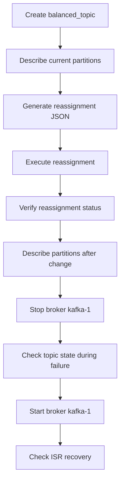

## Kafka Partition Reassignment Task Plan

### Goal
Prepare automation assets to complete partition balancing and broker-failure diagnostics for the existing 3-broker Kafka cluster defined in `docker-compose.yml`.

### Deliverables
1. `cmd` scripts as primary execution path
2. PowerShell alternatives documented in the instruction
3. One markdown runbook with step-by-step execution and validation

### Planned Project Structure
```text
scripts/
  01-create-topic.cmd
  02-describe-topic-before.cmd
  03-generate-reassignment-json.cmd
  04-execute-reassignment.cmd
  05-verify-reassignment.cmd
  06-describe-topic-after.cmd
  07-stop-broker-kafka-1.cmd
  08-check-topics-during-failure.cmd
  09-start-broker-kafka-1.cmd
  10-check-isr-recovery.cmd
assets/
  topics-to-move.json
  reassignment.json            # generated
plans/
  kafka-reassignment-instruction.md
```

### Script Design Details

#### `01-create-topic.cmd`
- Create `balanced_topic` with:
  - partitions: `8`
  - replication-factor: `3`
- Use containerized Kafka CLI via `docker compose exec kafka-1`.

#### `02-describe-topic-before.cmd`
- Capture current partition layout for `balanced_topic`.
- Command: `kafka-topics --describe --topic balanced_topic`.

#### `03-generate-reassignment-json.cmd`
- Generate reassignment proposal using:
  - input: `assets/topics-to-move.json`
  - broker list: `1,2,3`
- Output redirected to `assets/reassignment.json`.

#### `04-execute-reassignment.cmd`
- Apply reassignment using generated `assets/reassignment.json`.

#### `05-verify-reassignment.cmd`
- Verify progress/state with `--verify` against same JSON.

#### `06-describe-topic-after.cmd`
- Re-check final topic layout to confirm config changed.

#### Failure Simulation

#### `07-stop-broker-kafka-1.cmd`
- Stop broker container `kafka-1`.

#### `08-check-topics-during-failure.cmd`
- Inspect topic metadata while one broker is down.
- Validate leader movement and ISR reduction.

#### `09-start-broker-kafka-1.cmd`
- Start broker container again.

#### `10-check-isr-recovery.cmd`
- Re-run describe checks until ISR is fully restored.

### Data Files

#### `assets/topics-to-move.json`
```json
{
  "topics": [
    { "topic": "balanced_topic" }
  ],
  "version": 1
}
```

### Workflow Diagram


### Validation Criteria
- `balanced_topic` exists with `8` partitions and RF `3`
- Reassignment verify command reports success
- Topic description before and after reassignment differs as expected
- During broker stop: reduced ISR and leader changes are visible
- After restart: ISR returns to full replica set for all partitions

### Implementation Notes
- Keep scripts idempotent where possible
- Use explicit `echo` logging so outputs are easy to screenshot for assignment submission
- Prefer `docker compose` syntax and no Linux-only shell utilities in `.cmd` files
