# Marketplace Analytics Platform

Аналитическая платформа для маркетплейса «Покупай выгодно». Проект собирает данные о товарах и действиях клиентов, фильтрует запрещённые товары, сохраняет данные в HDFS и PostgreSQL, рассчитывает рекомендации через Spark и предоставляет мониторинг инфраструктуры.

Реализация итогового проекта курса по Apache Kafka (`docs/Task.md`).

---

## Быстрый старт

Одна команда для полного end-to-end прогона:

```bash
./scripts/demo.sh
```

Скрипт последовательно: сгенерирует TLS-сертификаты, загрузит JMX-агент, поднимет оба Kafka-кластера, PostgreSQL, HDFS, Spark, сервисы фильтрации и загрузки данных, засеет тестовые данные, запустит Spark-рекомендации и мониторинг.

Пошаговый ручной запуск описан ниже в разделе «Запуск».

Инструкция по пошаговой проверке в отдельном файле docs\ImplemetationPlan.md

---

## Использованные технологии

| Компонент | Технология | Назначение | Почему выбрана |
|-----------|-----------|------------|----------------|
| **Event bus** | Apache Kafka 3.8 (KRaft) | Передача событий между сервисами | Требование проекта. KRaft — без ZooKeeper, проще в развёртывании |
| **Безопасность** | TLS/mTLS + ACL | Шифрование данных и разграничение доступа к топикам | Требование проекта. Каждый сервис имеет собственный сертификат и ограниченный набор прав |
| **Потоковая обработка** | Goka (Go) | Фильтрация запрещённых товаров в реальном времени | Выбрана из трёх вариантов (Kafka Streams, Faust, Goka). Goka нативна для Go-стека проекта, не требует JVM, встраивается в бинарник сервиса |
| **Репликация** | MirrorMaker 2 | Дублирование данных между кластерами | Требование проекта. Нативное решение Kafka, поддерживает offset-синхронизацию и heartbeat |
| **Хранилище / поиск** | PostgreSQL 16 | Хранение товаров и полнотекстовый поиск | Выбран расширенный вариант вместо Elasticsearch. PostgreSQL покрывает требования поиска через `tsvector`, не требует отдельного кластера, проще в эксплуатации |
| **Data Lake** | HDFS 3.2.1 | Хранение аналитических данных | Требование проекта. Обеспечивает отказоустойчивое хранение для пакетной обработки Spark |
| **Аналитика** | Apache Spark 3.5.1 | Пакетный расчёт рекомендаций | Требование проекта. Читает данные из HDFS, вычисляет top-5 товаров по категориям, пишет результат в Kafka |
| **Мониторинг** | Prometheus + Grafana + Alertmanager | Сбор метрик, дашборды, алерты | Требование проекта. JMX Exporter собирает метрики Kafka, Grafana отображает статус брокеров и throughput, Alertmanager оповещает о падении брокеров |
| **Сервисы** | Go 1.23 | Все микросервисы | Единый язык для всего проекта, компиляция в статические бинарники, минимальные образы Docker |
| **Инфраструктура** | Docker Compose | Оркестрация всех сервисов | Всё окружение в одном `docker-compose.yml`, воспроизводимо на любой машине |

---

## Архитектура

```mermaid
flowchart LR
    subgraph sources["Источники данных"]
        shop["SHOP API<br/>(Go)"]
        client["CLIENT API<br/>(Go)"]
    end

    subgraph kafka1["Apache Kafka — Primary Cluster"]
        raw["shop.products.raw"]
        allowed["shop.products.allowed"]
        rejected["shop.products.rejected"]
        dlq["shop.products.dlq"]
        forbidden["forbidden.products.state<br/>(compacted)"]
        search_req["client.search.requests"]
        rec_req["client.recommendation.requests"]
    end

    subgraph processors["Обработка"]
        goka["Product Filter<br/>(Goka stream processor)"]
        pg_sink["PostgreSQL Sink<br/>(Go consumer)"]
        forbidden_cli["Forbidden CLI<br/>(Go)"]
    end

    subgraph storage["Хранилище"]
        pg[("PostgreSQL<br/>products + поиск")]
    end

    mirror["MirrorMaker 2"]

    subgraph kafka2["Apache Kafka — Secondary Cluster"]
        allowed2["shop.products.allowed"]
        search2["client.search.requests"]
        rec2["client.recommendation.requests"]
        rec_out["analytics.recommendations<br/>(compacted)"]
    end

    subgraph analytics["Аналитика"]
        hdfs_ingest["HDFS Ingestor<br/>(Go consumer)"]
        hdfs[("HDFS<br/>Data Lake")]
        spark["Spark<br/>Recommendations"]
    end

    subgraph monitoring["Мониторинг"]
        prom["Prometheus"]
        grafana["Grafana"]
        alert["Alertmanager"]
    end

    shop -->|"пишет product events"| raw
    forbidden_cli -->|"add / remove / list"| forbidden
    raw -->|"читает"| goka
    forbidden -->|"lookup"| goka
    goka -->|"allowed"| allowed
    goka -->|"rejected"| rejected
    goka -->|"invalid"| dlq
    allowed -->|"читает"| pg_sink
    pg_sink -->|"upsert"| pg
    client -->|"search / recommend"| search_req
    client -->|"search / recommend"| rec_req
    client -->|"читает"| pg

    allowed --> mirror
    search_req --> mirror
    rec_req --> mirror

    mirror -->|"реплицирует"| allowed2
    mirror -->|"реплицирует"| search2
    mirror -->|"реплицирует"| rec2

    allowed2 -->|"читает"| hdfs_ingest
    search2 -->|"читает"| hdfs_ingest
    rec2 -->|"читает"| hdfs_ingest
    hdfs_ingest -->|"пишет JSON"| hdfs
    hdfs -->|"читает"| spark
    spark -->|"пишет рекомендации"| rec_out

    kafka1 -->|"JMX метрики"| prom
    kafka2 -->|"JMX метрики"| prom
    prom --> grafana
    prom -->|"алерты"| alert

    classDef source fill:#f3f3f3,stroke:#333,color:#111
    classDef kafka fill:#aa98f5,stroke:#5c4db1,color:#fff
    classDef processor fill:#47bf70,stroke:#2d8a4e,color:#111
    classDef storage fill:#ffcc16,stroke:#cc9900,color:#111
    classDef analytics fill:#ff8738,stroke:#cc6600,color:#111
    classDef monitor fill:#ef3b2d,stroke:#b52018,color:#fff
    classDef infra fill:#e6e6e6,stroke:#999,color:#111

    class shop,client source
    class raw,allowed,rejected,dlq,forbidden,search_req,rec_req,allowed2,search2,rec2,rec_out kafka
    class goka,pg_sink,forbidden_cli processor
    class pg storage
    class hdfs_ingest,hdfs,spark analytics
    class prom,grafana,alert monitor
    class mirror infra
```



### Поток данных

1. **SHOP API** читает `data/products.json` и публикует события в `shop.products.raw`
2. **Product Filter** (Goka) проверяет каждый товар по `forbidden.products.state`: разрешённые → `shop.products.allowed`, запрещённые → `shop.products.rejected`, невалидные → `shop.products.dlq`
3. **PostgreSQL Sink** пишет разрешённые товары в PostgreSQL с полнотекстовым индексом
4. **CLIENT API** ищет товары через PostgreSQL и публикует события поиска/рекомендаций в Kafka
5. **MirrorMaker 2** реплицирует `shop.products.allowed`, `client.search.requests`, `client.recommendation.requests` во второй кластер
6. **HDFS Ingestor** читает из второго кластера и сохраняет данные в HDFS + локальный `data-lake/`
7. **Spark** читает товары из HDFS, вычисляет top-5 по категориям (score = доступный сток / 100), пишет результат в `analytics.recommendations`

---

## Запуск

### 1. Сертификаты и JMX-агент

```bash
./scripts/generate-certs.sh
./scripts/download-jmx-agent.sh
```

### 2. Инфраструктура

Поднять оба кластера Kafka, PostgreSQL, HDFS и Spark:

```bash
docker compose --profile app --profile analytics up -d --build
```

Это запускает: 6 брокеров Kafka, создание топиков и ACL, MirrorMaker 2, PostgreSQL, HDFS (namenode + datanode), Spark (master + worker), product-filter, postgres-sink, hdfs-ingestor.

### 3. Сидирование данных

```bash
docker compose --profile jobs run --rm forbidden-cli
docker compose --profile jobs run --rm shop-api
docker compose --profile jobs run --rm client-api
```

### 4. Spark-рекомендации

Дождаться репликации MirrorMaker (≈15 секунд), затем:

```bash
docker compose --profile analytics --profile analytics-jobs run --rm spark-recommendations
```

### 5. Мониторинг

```bash
docker compose --profile monitoring up -d
```

### 6. Верификация

```bash
# Локальные JSONL-файлы
ls -R data-lake/

# HDFS
docker compose exec namenode hdfs dfs -ls -R /marketplace-analytics

# Топик рекомендаций
docker compose exec kafka2-1 bash -lc 'unset KAFKA_OPTS; /opt/bitnami/kafka/bin/kafka-console-consumer.sh \
  --bootstrap-server kafka2-1:29092,kafka2-2:29092,kafka2-3:29092 \
  --consumer.config /opt/bitnami/kafka/config/certs/admin-ssl.properties \
  --topic analytics.recommendations --from-beginning --timeout-ms 5000'

# PostgreSQL
docker compose exec postgres psql -U marketplace -d marketplace \
  -c "SELECT product_id, name, category, price_amount FROM products ORDER BY name;"
```

---

## Эндпоинты

| Сервис | URL | Учётные данные |
|--------|-----|----------------|
| Primary Kafka brokers | `localhost:9092`, `:9094`, `:9096` | TLS-сертификаты |
| Secondary Kafka brokers | `localhost:9192`, `:9194`, `:9196` | TLS-сертификаты |
| PostgreSQL | `localhost:5432` | `marketplace` / `marketplace` |
| HDFS UI | http://localhost:9870 | — |
| Spark UI | http://localhost:8080 | — |
| Prometheus | http://localhost:9090 | — |
| Grafana | http://localhost:3000 | `admin` / `admin` |
| Alertmanager | http://localhost:9093 | — |

---

## Топики Kafka

| Топик | Кластер | cleanup.policy | Назначение |
|-------|---------|----------------|------------|
| `shop.products.raw` | Primary | delete | Сырые события товаров от магазинов |
| `shop.products.allowed` | Primary | delete | Только разрешённые товары |
| `shop.products.rejected` | Primary | delete | Запрещённые товары (аудит) |
| `shop.products.dlq` | Primary | delete | Невалидные события |
| `client.search.requests` | Primary | delete | Поисковые запросы клиентов |
| `client.recommendation.requests` | Primary | delete | Запросы рекомендаций |
| `forbidden.products.state` | Primary | compact | Состояние запрещённых товаров |
| `analytics.recommendations` | Secondary | compact | Рассчитанные рекомендации |

Все топики: `replication.factor=3`, `min.insync.replicas=2`, `partitions=3`.

---

## Модель ACL

| Принципал (CN) | Операции |
|----------------|----------|
| `shop-api` | Write `shop.products.raw` |
| `product-filter` | Read `shop.products.raw` + `forbidden.products.state`; Write `shop.products.allowed/.rejected/.dlq` |
| `postgres-sink` | Read `shop.products.allowed` |
| `client-api` | Write `client.search.requests` + `client.recommendation.requests`; Read `analytics.recommendations` |
| `admin` | Write/Read `forbidden.products.state` |
| `mirror-maker` | Read/Write все топики + Create |

---

## Структура проекта

```
.
├── analytics/
│   └── spark-recommendations/   # PySpark-джоба расчёта рекомендаций
├── configs/
│   ├── alertmanager/            # Конфигурация Alertmanager
│   ├── grafana/                 # Дашборды и provisioning
│   ├── hadoop/                  # core-site.xml для HDFS
│   ├── jmx/                     # JMX Exporter agent + конфиг
│   ├── kafka/                   # Сертификаты, mm2.properties
│   ├── postgres/                # SQL-схема
│   └── prometheus/              # Конфигурация, правила алертов
├── data/
│   ├── products.json            # Тестовые товары
│   └── forbidden-products.seed.json
├── data-lake/                   # Локальное зеркало HDFS
├── docs/
│   ├── Task.md                  # Исходное задание
│   └── ImplementationPlan.md    # План реализации
├── internal/
│   ├── events/                  # Go-структуры событий и валидация
│   ├── gokautil/                # Утилиты для Goka
│   ├── kafkautil/               # Kafka-клиенты с TLS
│   ├── postgres/                # SQL-схема (schema.sql)
│   └── productio/               # Чтение products.json
├── scripts/
│   ├── create-acls.sh           # Создание ACL
│   ├── create-topics.sh         # Создание топиков
│   ├── demo.sh                  # Автоматический end-to-end прогон
│   ├── download-jmx-agent.sh    # Загрузка JMX-агента
│   ├── generate-certs.sh        # Генерация TLS-сертификатов
│   └── reset.sh                 # Полный сброс окружения
├── services/
│   ├── client-api/              # CLI: search, recommend
│   ├── forbidden-cli/           # CLI: add, remove, list запрещённых
│   ├── hdfs-ingestor/           # Kafka → HDFS + data-lake
│   ├── postgres-sink/           # Kafka → PostgreSQL
│   ├── product-filter/          # Goka-фильтр запрещённых товаров
│   └── shop-api/                # Отправка товаров в Kafka
├── docker-compose.yml
├── Dockerfile
├── go.mod
├── go.sum
└── README.md
```

---

## Сброс окружения

```bash
./scripts/reset.sh
```

Удаляет все контейнеры, тома и сгенерированные сертификаты.
