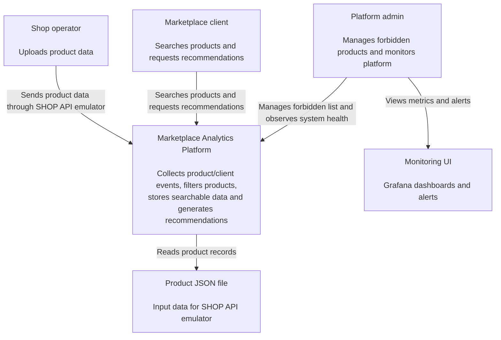
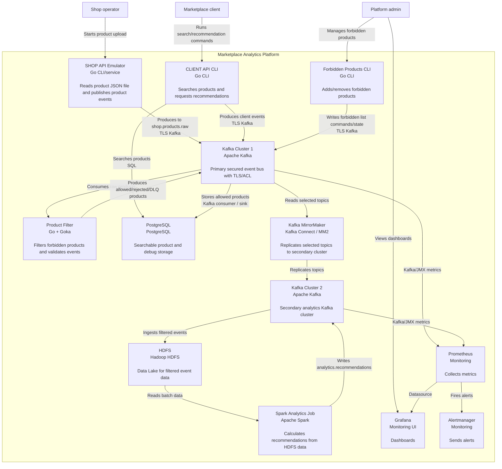
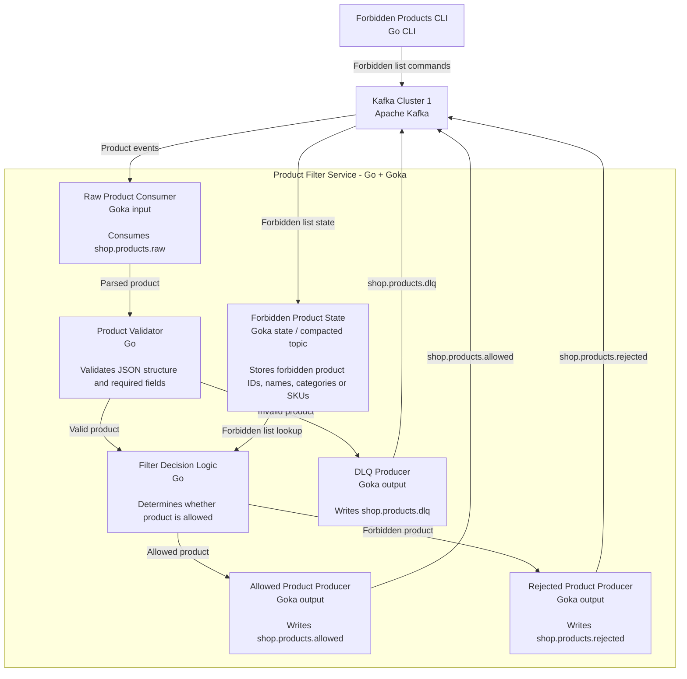
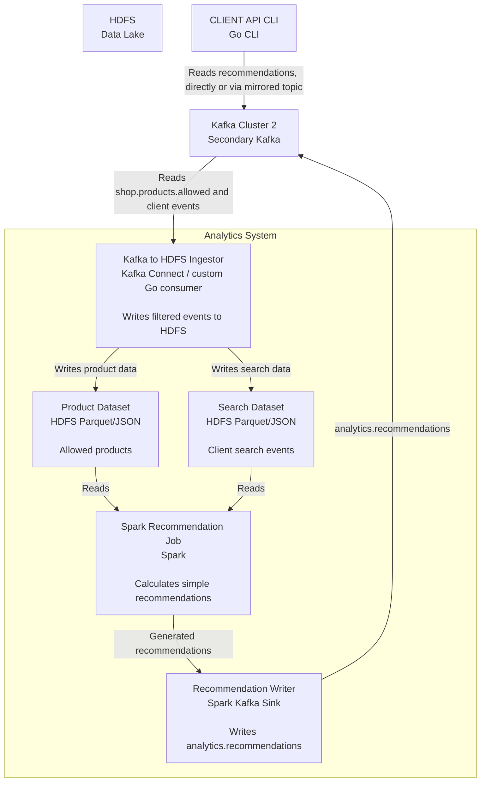

# Marketplace Analytics Platform — Detailed Implementation Plan

## 1. Selected stack

- **Analytics:** HDFS + Spark
- **Storage/search:** PostgreSQL
- **Stream processing:** Goka
- **Services:** Go
- **Infrastructure:** Docker Compose
- **Kafka:** two clusters, TLS, ACL, replication, topic mirroring
- **Monitoring:** Prometheus, JMX Exporter, Grafana, Alertmanager

---

## 2. Target architecture

### Main data flow

```text
SHOP API emulator
    reads products.json
    writes product events
        ↓
Kafka Cluster 1: shop.products.raw
        ↓
Goka filtering service
    checks forbidden products
        ↓
Kafka Cluster 1: shop.products.allowed
        ↓
PostgreSQL sink / consumer
        ↓
PostgreSQL product search storage

Kafka Cluster 1
        ↓ MirrorMaker / replication
Kafka Cluster 2
        ↓
HDFS ingestion
        ↓
Spark batch analytics
        ↓
Kafka Cluster 2: analytics.recommendations
        ↓ optional mirroring back
Kafka Cluster 1: analytics.recommendations
        ↓
CLIENT API CLI
```

---

## 3. Kafka topic model

| Topic | Cluster | Producer | Consumer | Purpose |
|---|---|---|---|---|
| `shop.products.raw` | Primary | SHOP API | Goka filter | Raw product events from shops |
| `shop.products.allowed` | Primary | Goka filter | PostgreSQL sink, MirrorMaker | Only allowed products |
| `shop.products.rejected` | Primary | Goka filter | Debug/admin | Forbidden products |
| `shop.products.dlq` | Primary | Goka filter | Debug/admin | Invalid product events |
| `client.search.requests` | Primary | CLIENT API | MirrorMaker, analytics | User search events |
| `client.recommendation.requests` | Primary | CLIENT API | MirrorMaker, analytics | Recommendation request events |
| `analytics.recommendations` | Secondary / mirrored | Spark | CLIENT API | Generated recommendations |
| `forbidden.products.commands` | Primary | Forbidden CLI | Goka/admin service | Manage forbidden products |
| `forbidden.products.state` | Primary | Forbidden CLI / Goka | Goka | Compacted forbidden-product state |

Recommended topic config:

```text
shop.products.raw:
  cleanup.policy=delete
  replication.factor=3
  min.insync.replicas=2

shop.products.allowed:
  cleanup.policy=delete
  replication.factor=3
  min.insync.replicas=2

forbidden.products.state:
  cleanup.policy=compact
  replication.factor=3
  min.insync.replicas=2

analytics.recommendations:
  cleanup.policy=compact
  replication.factor=3
  min.insync.replicas=2
```

---

## 4. C4 model

### 4.1 C1 — System Context



### 4.2 C2 — Container Diagram



### 4.3 C3 — Goka filtering service



### 4.4 C3 — Analytics pipeline



---

## 5. Detailed implementation stages

### Stage 0 — Repository structure

Recommended structure:

```text
.
├── docker-compose.yml
├── README.md
├── docs/
│   ├── Task.md
│   ├── architecture.md
│   ├── c4/
│   │   ├── C1_System_Context.puml
│   │   ├── C2_Containers.puml
│   │   ├── C3_Goka_Filter.puml
│   │   └── C3_Analytics.puml
├── data/
│   ├── products.json
│   └── forbidden-products.seed.json
├── configs/
│   ├── kafka/
│   ├── prometheus/
│   ├── grafana/
│   ├── alertmanager/
│   ├── postgres/
│   ├── hdfs/
│   └── spark/
├── services/
│   ├── shop-api/
│   ├── client-api/
│   ├── forbidden-cli/
│   ├── product-filter/
│   ├── postgres-sink/
│   └── hdfs-ingestor/
├── analytics/
│   └── spark-recommendations/
└── scripts/
    ├── generate-certs.sh
    ├── create-topics.sh
    ├── create-acls.sh
    ├── demo.sh
    └── reset.sh
```

### Stage 1 — Event contracts

#### Product event

Use the task JSON as the canonical product schema and wrap it with event metadata:

```json
{
  "event_id": "uuid",
  "event_type": "product_created_or_updated",
  "event_time": "2026-05-12T12:00:00Z",
  "source": "shop-api",
  "payload": {
    "product_id": "12345",
    "name": "Умные часы XYZ",
    "description": "...",
    "price": {
      "amount": 4999.99,
      "currency": "RUB"
    },
    "category": "Электроника",
    "brand": "XYZ",
    "stock": {
      "available": 150,
      "reserved": 20
    },
    "sku": "XYZ-12345",
    "tags": ["умные часы", "гаджеты"],
    "images": [],
    "specifications": {},
    "created_at": "2023-10-01T12:00:00Z",
    "updated_at": "2023-10-10T15:30:00Z",
    "index": "products",
    "store_id": "store_001"
  }
}
```

#### Search event

```json
{
  "event_id": "uuid",
  "event_type": "product_search_requested",
  "event_time": "2026-05-12T12:00:00Z",
  "user_id": "user_001",
  "query": "умные часы"
}
```

#### Recommendation request event

```json
{
  "event_id": "uuid",
  "event_type": "recommendation_requested",
  "event_time": "2026-05-12T12:00:00Z",
  "user_id": "user_001",
  "category": "Электроника"
}
```

#### Recommendation event

```json
{
  "recommendation_id": "uuid",
  "user_id": "user_001",
  "category": "Электроника",
  "products": [
    {
      "product_id": "12345",
      "name": "Умные часы XYZ",
      "score": 0.95
    }
  ],
  "calculated_at": "2026-05-12T12:00:00Z"
}
```

### Stage 2 — Docker Compose infrastructure

Services to include:

```text
Primary Kafka cluster:
  kafka1-broker-1
  kafka1-broker-2
  kafka1-broker-3

Secondary Kafka cluster:
  kafka2-broker-1
  kafka2-broker-2
  kafka2-broker-3

Kafka infrastructure:
  mirror-maker-2
  kafka-init

Storage:
  postgres
  hdfs-namenode
  hdfs-datanode

Analytics:
  spark-master
  spark-worker
  spark-submit container

Monitoring:
  prometheus
  grafana
  alertmanager
  jmx-exporter configs

Application services:
  shop-api
  client-api
  forbidden-cli
  product-filter
  postgres-sink
  hdfs-ingestor
```

Important compose requirements:

- Separate Docker networks:
  - `app-net`
  - `monitoring-net`
- Healthchecks for:
  - Kafka brokers
  - PostgreSQL
  - HDFS NameNode
  - Spark master
  - Prometheus
- Named volumes for:
  - Kafka data
  - PostgreSQL data
  - HDFS data
  - Grafana dashboards

### Stage 3 — Kafka security: TLS and ACL

#### TLS

Generate certificates for:

```text
kafka brokers
shop-api
client-api
product-filter
forbidden-cli
postgres-sink
mirror-maker
hdfs-ingestor
spark
admin
```

Each client should have its own principal.

Example principals:

```text
User:shop-api
User:client-api
User:product-filter
User:forbidden-cli
User:postgres-sink
User:mirror-maker
User:hdfs-ingestor
User:spark
User:admin
```

#### ACL table

| Principal | Permission |
|---|---|
| `User:shop-api` | Write `shop.products.raw` |
| `User:client-api` | Write `client.search.requests`, `client.recommendation.requests`; Read `analytics.recommendations` |
| `User:product-filter` | Read `shop.products.raw`, `forbidden.products.state`; Write `shop.products.allowed`, `shop.products.rejected`, `shop.products.dlq` |
| `User:forbidden-cli` | Write `forbidden.products.commands`, `forbidden.products.state` |
| `User:postgres-sink` | Read `shop.products.allowed` |
| `User:mirror-maker` | Read selected primary topics; Write secondary topics |
| `User:hdfs-ingestor` | Read secondary Kafka topics |
| `User:spark` | Read HDFS; Write `analytics.recommendations` |
| `User:admin` | Create topics, describe cluster, manage ACLs |

### Stage 4 — SHOP API emulator

#### Responsibility

- Read `data/products.json`.
- Validate basic JSON.
- Send each product to `shop.products.raw`.

#### CLI example

```bash
go run ./services/shop-api \
  --file ./data/products.json \
  --brokers kafka1-broker-1:9093 \
  --topic shop.products.raw
```

#### Implementation details

- Use `segmentio/kafka-go` or Confluent Go client.
- Send product key as `product_id`.
- Add envelope fields:
  - `event_id`
  - `event_time`
  - `source`
  - `event_type`
- Log success/failure per product.

### Stage 5 — CLIENT API CLI

#### Commands

```bash
client-api search --user-id user_001 --query "умные часы"

client-api recommend --user-id user_001 --category "Электроника"
```

#### Search flow

```text
CLI command
  ↓
write search event to Kafka: client.search.requests
  ↓
query PostgreSQL product table
  ↓
print matching products
```

#### Recommendation flow

```text
CLI command
  ↓
write recommendation request to Kafka
  ↓
read latest recommendations from Kafka or PostgreSQL cache
  ↓
print recommended products
```

Recommended pragmatic implementation:

- CLIENT API reads search results from PostgreSQL.
- Recommendations can be:
  - consumed from `analytics.recommendations`,
  - cached in PostgreSQL,
  - then returned from PostgreSQL by `user_id` or `category`.

### Stage 6 — Forbidden products management

#### CLI commands

```bash
forbidden-cli add --product-id 12345 --reason "Prohibited product"

forbidden-cli remove --product-id 12345

forbidden-cli list
```

#### Storage

Use Kafka compacted topic:

```text
forbidden.products.state
```

Key:

```text
product_id
```

Value:

```json
{
  "product_id": "12345",
  "reason": "Prohibited product",
  "created_at": "2026-05-12T12:00:00Z",
  "active": true
}
```

For delete/removal:

```json
{
  "product_id": "12345",
  "active": false
}
```

Optional: also store in PostgreSQL for easier admin/debug visibility.

### Stage 7 — Goka product filter

#### Responsibility

Consume:

```text
shop.products.raw
```

Check:

```text
forbidden.products.state
```

Produce:

```text
shop.products.allowed
shop.products.rejected
shop.products.dlq
```

#### Filtering rules

Reject product if:

- `product_id` is in forbidden list,
- `sku` is in forbidden list,
- `name` matches forbidden name,
- category is forbidden,
- required fields are missing,
- price is invalid,
- stock is invalid.

Recommended MVP:

- filter by `product_id`,
- optionally by `category`.

#### Processing logic

```text
Receive product event
  ↓
Validate JSON schema
  ↓
If invalid:
    write to shop.products.dlq
  ↓
Check forbidden state by product_id
  ↓
If forbidden:
    write to shop.products.rejected
  ↓
Else:
    write to shop.products.allowed
```

### Stage 8 — PostgreSQL storage/search

#### Tables

```sql
CREATE TABLE products (
    product_id TEXT PRIMARY KEY,
    name TEXT NOT NULL,
    description TEXT,
    category TEXT,
    brand TEXT,
    sku TEXT,
    store_id TEXT,
    price_amount NUMERIC(12, 2),
    price_currency TEXT,
    stock_available INTEGER,
    stock_reserved INTEGER,
    tags TEXT[],
    raw_payload JSONB NOT NULL,
    created_at TIMESTAMPTZ,
    updated_at TIMESTAMPTZ,
    ingested_at TIMESTAMPTZ DEFAULT now()
);
```

Full-text search:

```sql
ALTER TABLE products
ADD COLUMN search_vector tsvector;

CREATE INDEX idx_products_search_vector
ON products USING GIN(search_vector);

CREATE INDEX idx_products_category
ON products(category);

CREATE INDEX idx_products_tags
ON products USING GIN(tags);
```

Trigger or application update:

```sql
search_vector =
  to_tsvector('russian', coalesce(name, '') || ' ' || coalesce(description, '') || ' ' || coalesce(category, ''));
```

#### PostgreSQL sink

Can be implemented as a Go service:

```text
Kafka consumer: shop.products.allowed
  ↓
upsert into products
```

Upsert by `product_id`.

### Stage 9 — Second Kafka cluster and topic mirroring

Use MirrorMaker 2 or equivalent Kafka Connect setup.

Recommended mirrored topics:

```text
shop.products.allowed
client.search.requests
client.recommendation.requests
```

Optional:

```text
shop.products.rejected
shop.products.dlq
```

Avoid using raw products for analytics unless explicitly documenting why. Analytics should use filtered data.

#### Replication rule

```text
Primary Kafka Cluster
  ↓
MirrorMaker 2
  ↓
Secondary Kafka Cluster
```

The secondary cluster becomes the analytics source.

### Stage 10 — HDFS ingestion

Options:

1. Kafka Connect HDFS sink.
2. Custom Go consumer.
3. Spark Structured Streaming writing to HDFS.

Recommended for control and simplicity:

```text
Custom Go hdfs-ingestor
```

Flow:

```text
Kafka Cluster 2: shop.products.allowed
  ↓
hdfs-ingestor
  ↓
HDFS path: /data/products/date=YYYY-MM-DD/products.jsonl
```

Also ingest:

```text
client.search.requests
client.recommendation.requests
```

HDFS layout:

```text
/data/
  products/
    date=2026-05-12/
      part-0001.jsonl
  searches/
    date=2026-05-12/
      part-0001.jsonl
  recommendation_requests/
    date=2026-05-12/
      part-0001.jsonl
```

### Stage 11 — Spark analytics

#### Goal

The task allows any analytics. Keep the algorithm simple and explainable.

Recommended recommendation algorithm:

```text
For every category:
  1. Count product searches by query/category.
  2. Count available products per category.
  3. Rank products by:
       search popularity of category
       stock availability
       recency
  4. Produce top N products per category.
```

Alternative:

```text
Popular products by category based on search events.
```

#### Spark input

```text
/data/products/date=*/products.jsonl
/data/searches/date=*/searches.jsonl
```

#### Spark output

Write recommendations to Kafka topic:

```text
analytics.recommendations
```

Example output key:

```text
category:Электроника
```

Example output value:

```json
{
  "recommendation_id": "uuid",
  "category": "Электроника",
  "products": [
    {
      "product_id": "12345",
      "name": "Умные часы XYZ",
      "score": 0.95
    }
  ],
  "calculated_at": "2026-05-12T12:00:00Z"
}
```

### Stage 12 — Monitoring

#### Metrics to collect

Kafka:

```text
broker availability
under-replicated partitions
offline partitions
request rate
produce/consume rate
consumer lag
ISR shrink/expand events
disk usage if available
```

Application:

```text
products produced
products allowed
products rejected
DLQ count
PostgreSQL sink failures
HDFS ingestion failures
Spark job duration
```

PostgreSQL:

```text
connection count
query latency
table size
insert/update count
```

#### Prometheus

Use:

```text
JMX Exporter for Kafka
node/container metrics if available
custom Go /metrics endpoint for services
```

#### Grafana dashboards

Required dashboards:

1. Kafka Cluster 1 health.
2. Kafka Cluster 2 health.
3. Topic throughput.
4. Consumer lag.
5. Filtering statistics.
6. PostgreSQL sink status.
7. Spark analytics status.

#### Alertmanager rules

Minimum alerts:

```text
Kafka broker down
Under-replicated partitions > 0
Consumer lag too high
PostgreSQL unavailable
Product filter service down
Spark job failed
```

---

## 6. Demo scenario

Create a deterministic demo script:

```bash
./scripts/demo.sh
```

Steps:

```text
1. Start Docker Compose.
2. Wait for Kafka, PostgreSQL, HDFS, Spark.
3. Create Kafka topics.
4. Create ACLs.
5. Add forbidden product.
6. Run SHOP API emulator.
7. Verify:
   - raw product is in shop.products.raw
   - forbidden product appears in shop.products.rejected
   - allowed product appears in shop.products.allowed
8. Verify PostgreSQL contains only allowed products.
9. Run CLIENT API search.
10. Mirror filtered data to second Kafka cluster.
11. Ingest data to HDFS.
12. Run Spark recommendation job.
13. Verify analytics.recommendations topic.
14. Run CLIENT API recommendation command.
15. Open Grafana dashboard.
16. Stop one broker and verify Alertmanager alert.
```

---

## 7. Implementation order

Recommended order:

```text
1. Repository structure and event contracts.
2. Docker Compose with PostgreSQL and one Kafka broker without TLS.
3. SHOP API → Kafka.
4. Goka filter → allowed/rejected/DLQ topics.
5. PostgreSQL sink and CLIENT API search.
6. Add forbidden-products CLI.
7. Expand Kafka to 3 brokers.
8. Add TLS.
9. Add ACLs.
10. Add second Kafka cluster.
11. Add MirrorMaker.
12. Add HDFS.
13. Add Spark batch job.
14. Add recommendations topic and CLIENT API recommend command.
15. Add monitoring.
16. Add final README and diagrams.
```

This order reduces debugging complexity. TLS/ACL should be added after the basic message flow works.

---

## 8. Acceptance checklist

### Required

- Kafka transfers data between services.
- TLS is enabled.
- ACLs restrict topic access.
- Topics have replication.
- `min.insync.replicas` is configured.
- Data is duplicated to second Kafka cluster.
- Forbidden products are filtered.
- Filtered data is stored in PostgreSQL.
- Analytics is performed through HDFS + Spark.
- Recommendations are written to Kafka.
- Monitoring is configured.
- README explains startup and architecture.

### Extended

- PostgreSQL search is implemented.
- Forbidden products are managed through CLI.
- DLQ exists for invalid events.
- Rejected products are auditable.
- Grafana dashboard includes Kafka and application metrics.
- Alertmanager sends broker failure alerts.
- Demo script proves full flow end to end.

---

## 9. Key risks and mitigations

| Risk | Mitigation |
|---|---|
| Too many distributed systems in one Docker Compose | Build incrementally and keep business logic simple |
| TLS/ACL debugging complexity | First validate insecure local flow, then enable TLS/ACL |
| Forbidden products leaking downstream | PostgreSQL, HDFS and Spark must consume only `shop.products.allowed` |
| PostgreSQL search is not Elasticsearch | Use full-text indexes and document the design trade-off |
| Spark recommendation expectations are unclear | Use deterministic simple recommendations and document algorithm |
| Bad input can break processors | Validate schema and route invalid events to DLQ |
| Monitoring acceptance is vague | Include broker-down and under-replicated-partition alerts |
| Demo instability | Provide scripted deterministic demo data and commands |
